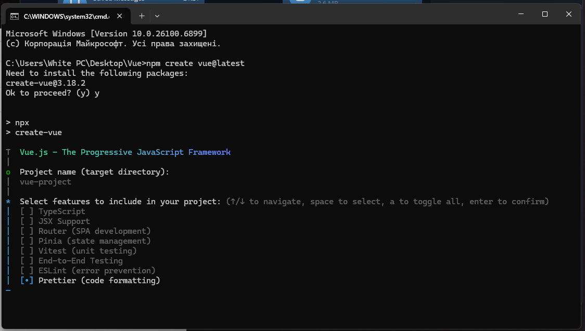
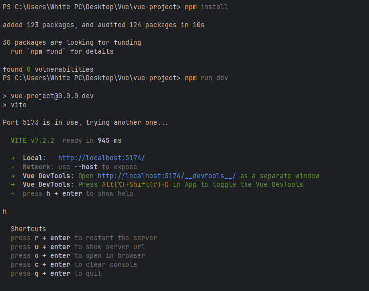
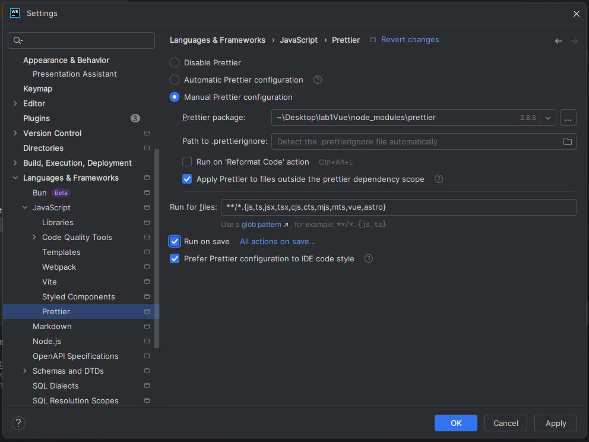
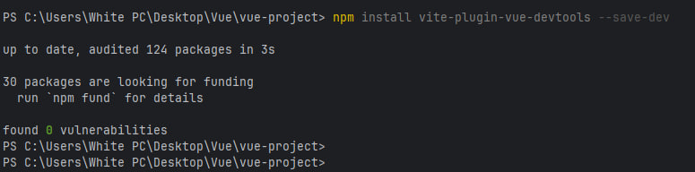
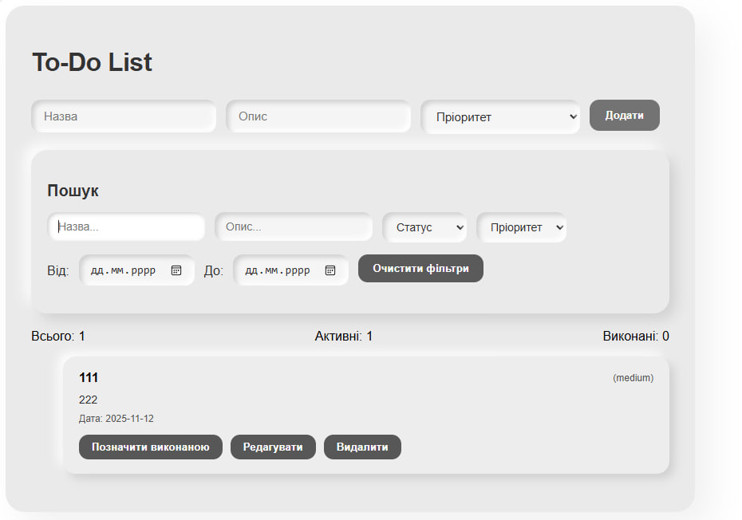
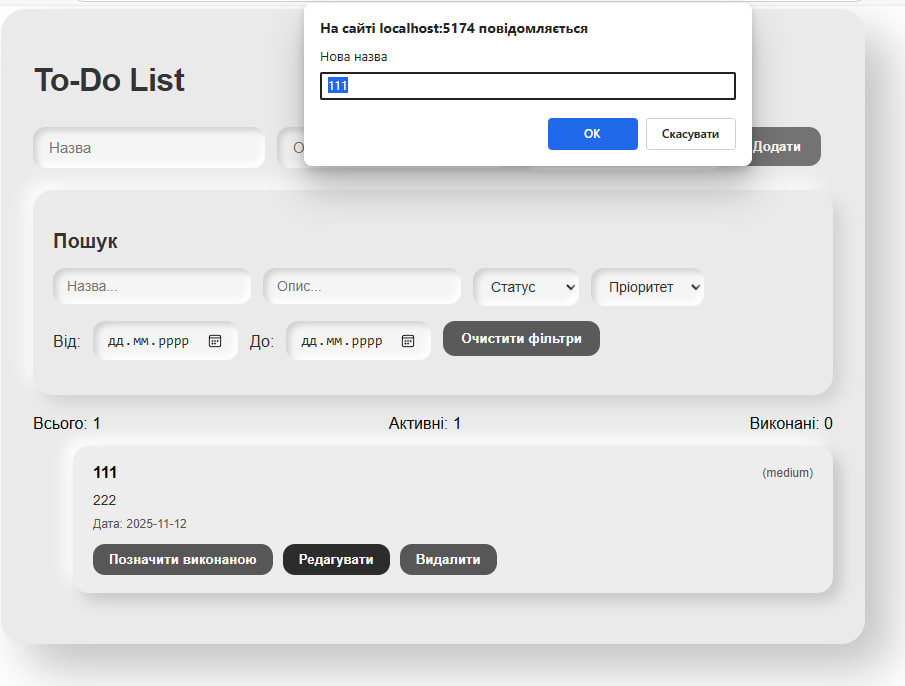
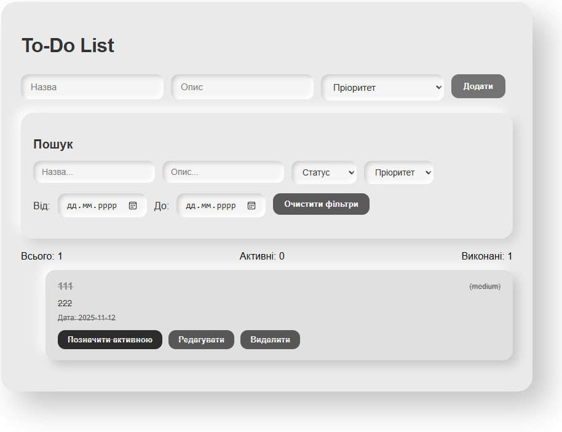

# Лабораторна робота №1
**Тема:** Знайомство з Vue.js 3 (Composition API)

---

## Мета роботи
Навчитися створювати та керувати реактивними даними за допомогою ref і reactive, будувати похідні значення через computed, реагувати на зміни через watch, використовувати директиви Vue (v-model, v-bind, v-on, v-for, v-if/else, v-show) і працювати з Vue DevTools та LocalStorage.

---

## Налаштування проєкту

1. Створено новий проєкт Vue 3 за допомогою **Vite**:
```bash
npm create vite@latest Lab1
cd vue-project
npm install
npm run dev

```



2. Встановлено Prettier для форматування



3. Додано плагін vite-plugin-vue-devtools



4. Розробка виконувалась у WebStorm

---

## Опис застосунку

Створено застосунок **To-Do List**, який дозволяє
- додавати, редагувати, видаляти завдання
- змінювати статус між active / done
- фільтрувати за статусом, пріоритетом і назвою
- очищати фільтри
- переглядати кількість активних, виконаних і всіх завдань
- зберігати список у LocalStorage

---

## Модель даних задачі
```js
{
  id: Number,
  title: String,
  description: String,
  status: 'active' | 'done',
  createdAt: Date,
  priority: 'low' | 'medium' | 'high'
}
```

---

## Реактивність

| Механізм | Де використано | Призначення                   |
|-----------|----------------|-------------------------------|
| `ref()` | список задач (`todos`), сторінка (`page`) | реактивні змінні              |
| `reactive()` | форма (`form`), фільтри (`filters`) | реактивні об’єкти             |
| `computed()` | `total`, `activeCount`, `doneCount`, `pagedTodos` | автоматичне оновлення |
| `watch()` | спостереження за `todos` (`deep: true`) | збереження у LocalStorage     |
```js
watch(todos, (val) => {
  localStorage.setItem('vue-project_todos', JSON.stringify(val))
}, { deep: true })

```
---

## Директиви Vue

| Директива | Де використана                        | Призначення            |
|------------|---------------------------------------|------------------------|
| `v-model` | інпути, textarea, select, checkbox    | двостороннє зв’язок    |
| `v-on` (`@`) | події (`@click`, `@change`)           | обробка кліків         |
| `v-bind` (`:`) | атрибути (`:key`, `:class`, `:style`) | динамічне класи, стилі |
| `v-for` | список задач                          | виведення колекції     |
| `v-if` / `v-show` | умови                                 | відображення елементів |

---

## Обчислення

- **`total`** — загальна кількість задач
- **`activeCount`** — активні
- **`doneCount`** — виконані

Ці значення оновлюються автоматично через computed

---

## Vue DevTools

У **Vue DevTools** перевірено:
- дерево компонентів (`TodoList`, `TodoItem`, `TodoFilters`)
- реактивні дані (`ref`, `reactive`)
- обчислення (`computed`)
- події коричтувача`click`, `input` у вкладці **Events**
- збереження даних у LocalStorage → vue-project_todos.
---

# Головний інтерфейс To-Do List з фільтрацією та редагуванням





---

## Висновок

Під час виконання лабораторної роботи я навчилася створювати простий вебзастосунок на **Vue.js 3**, використовуючи **Composition API**.
Я зрозуміла, як працює реактивність (`ref`, `reactive`), як створюються похідні значення через `computed` і як за допомогою `watch` зберігати дані у **LocalStorage**.
Також закріпила навички використання **директив Vue** та роботи з **Vue DevTools** для перевірки стану компонентів.
Результатом роботи є повноцінний застосунок **To-Do List** із зручним інтерфейсом, фільтрацією, редагуванням і збереженням даних.
